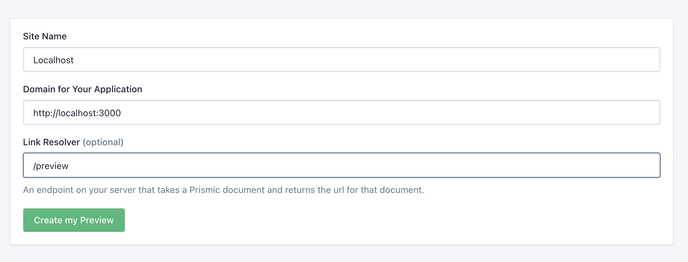

# About Prismic

Prismic is a cloud-hosted headless CMS. In the CMS you define your content-types and the content.

Each project should use a separate "Repository". To have a working backend, we created a Repository named: https://mutoco-starter.prismic.io/

## Setting up

For a new project, you should create a new repository in the [Prismic dashboard](https://prismic.io/dashboard). 
Make sure to choose a fitting repository name. For `mutoco-starter.prismic.io`, the repository name is `mutoco-starter`.

## Modelling content-types

This depends entirely on the requirements of the project. Here's the official documentation regarding content-modelling
in Prismic: https://prismic.io/docs/core-concepts#content-modeling

## Previewing locally

In the Settings of the prismic repo, navigate to "Previews" and create a new preview setting like shown in this
Screenshot:



## Resolving links

As soon as you start building content-types in prismic that match one of your SvelteKit routes (as we do here with the `[slug].svelte` route),
you need a way to tell which prismic type matches which route.

Imagine you have 3 different types in Prismic, with 3 matching routes in SvelteKit:

| Type    | Route                    |
| ------- | ------------------------ |
| news    | `/news/[slug].svelte`    |
| blog    | `/blog/[slug].svelte`    |
| product | `/product/[slug].svelte` |

In order for the frontend to know which type maps to which route, you need to create a `linkResolver` that maps the `type`.
Here's how the linkResolver would look for the above setup:

```javascript
export const linkResolver = doc => {
    switch (doc.type) {
        case 'news':
            return `/news/${doc.uid}`;
        case 'blog':
            return `/blog/${doc.uid}`;
        case 'product':
            return `/product/${doc.uid}`;
    }

    return `/${doc.uid || ''}`;
};
```

The `doc` data is something you'll get via the Prismic API. In GraphQL it's:

```graphql
_meta {
    uid
    type
}
```

